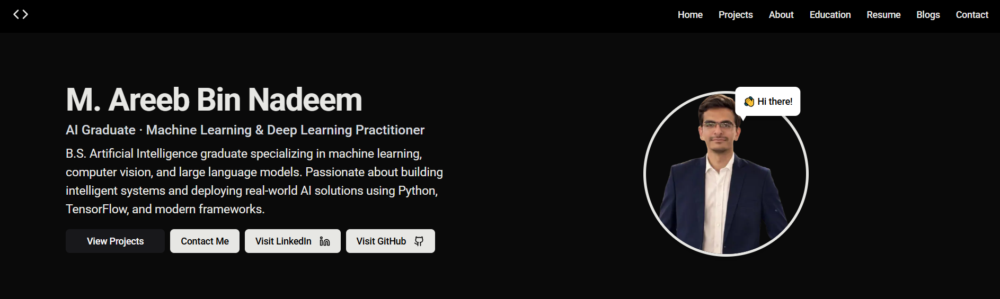

# 💼 Areeb Nadeem's Developer Portfolio

 

A modern, responsive, and blazing-fast personal portfolio built with **Next.js**, **Tailwind CSS**, and **TypeScript**. This site showcases my work, blog posts, and projects, designed to help potential employers, collaborators, and clients discover more about me and my skills.

---

## 🌐 Live Demo

🔗 [View Portfolio Website](https://your-deployed-link.vercel.app/)

---

## 🚀 Features

- ⚡ Built with **Next.js App Router** 
- 💅 Styled with **Tailwind CSS**
- ✍️ Blog Section (fetched from [Medium](https://medium.com))
- 🧠 Project Showcase

---

## 🧱 Tech Stack

| Technology     | Usage                            |
|----------------|----------------------------------|
| Next.js        | Frontend Framework (App Router)  |
| TypeScript     | Type Safety                      |
| Tailwind CSS   | Styling Framework                |
| ShadCN UI      | UI Components                    |
| Medium API     | Blog integration                 |

---

## 📁 Project Structure
```
portfolio-site-master/
├── app/ # App Router Pages
│ ├── (root)/
│ └── api/
├── components/ # Reusable UI components
├── lib/ # Utility functions and API logic
├── public/ # Static assets
├── styles/ # Global CSS
├── util/ # Upload logic, helpers
├── .env # Environment variables
└── tailwind.config.ts # Tailwind setup
```

---

## ⚙️ Getting Started (Local Setup)

### 1. Clone the repository

```bash
git clone https://github.com/your-username/portfolio-site.git
cd portfolio-site
```

### 2. Install dependencies

```bash
npm install
```

### 3. Run the development server
```bash
npm run dev
```

Visit http://localhost:3000 to view the site.

---

## 🛠️ Deployment
You can easily deploy the site using platforms like:
- Vercel
- Netlify

Just connect your GitHub repo and follow the instructions. The next.config.js and build setup are ready for production.

---

## 🙋‍♂️ About Me

Hi! I'm **Areeb Nadeem**, a passionate **AI enthusiast** from **FAST NUCES Karachi**. I specialize in building intelligent AI-driven applications that leverage data to solve real-world problems. From machine learning models to full-stack AI systems, I love turning complex ideas into practical, impactful solutions.

- 📧 **Email:** [M.AreebBinNadeem@gmail.com](mailto:M.AreebBinNadeem@gmail.com)  
- 🌐 **Portfolio:** [areeb.dev](https://areeb.dev)  
- 🧑‍💼 **LinkedIn:** [linkedin.com/in/areeb-nadeem](https://linkedin.com/in/areeb-nadeem)  
- 🐙 **GitHub:** [github.com/areebbinnadeem](https://github.com/areebbinnadeem)


